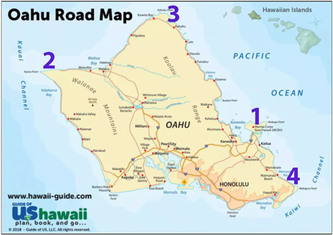
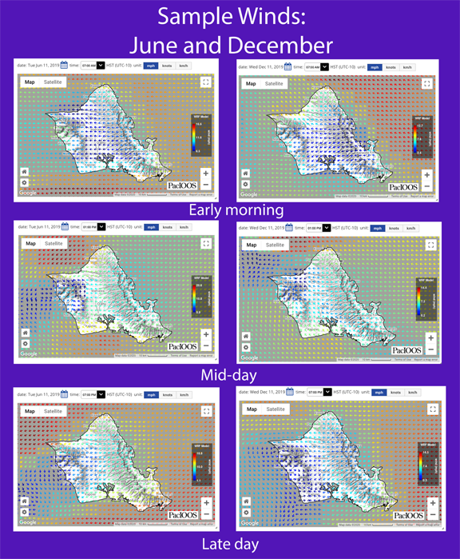

# surfs_up

## Summary
We seek to estabilsh a new business venture in Oahu, HI.  A surf and shake shop that will provide high quality surf equipment for sale and rental.  In order to do this, we need to augment our business plan with quantitative and qualitative data about weather and business climate that will help determine where on the island to build the business, and other product lines or opportunities to ensure the businesses' success in all weather types. This data will be used to update the business plan to accomodate for lessons learned by a key investor, W.Avy, that has launched similar ventures on the island. 

## Findings
With a surf shop, it is all about "location, location, location". Oahu is a small island, but with its rugged volcanic terrain, and central Pacific location there are many physical structures that influence how wind passes over the island, where wind will generate waves and what patterns of precipitation to expect from land/ocean/atmosphere interactions.  The temperature is moderate year round with only small variability from month to month. The Hawaiian island chains are subject to microclimates due to the aforementioned influences, so rain data can be highly variable from one location to another. Given this knowledge coming into the analysis: an understanding of the island topography that is bolstered by 1) temperature data 2) precipitation data and 3) wind data will strengthen the proposal and subsequent business venture.

### Analysis

###### Air temperature and precipitation
On the island of Oahu, there are many active weather monitoring stations that record consistent, real time data.  For this analysis, nine of those stations were identified at random locations around the island.  The months of June and December were analyzed in depth to see if there was notable seasonal variability between these two months.  Figure 1 below shows the difference in average precipitation (in inches) and air temperture (in degrees Farenheit) for all days in June between the year 2010 and 2017.  The average in air temperature varies only four degrees between the months, and rainfall averages vary only 0.08 inches.  There are nominal differences in average weather between these two months.  Certainly, not sufficient variation to alter business decisions.

####### Fig 1: Two month comparison of two key weather variables.
| ------------- | *June* | *December*
| ------------- | ------------- | ----------- |
| **Air Temperature**  | ------------  | ------------ |
| Air Temperature: Minimim (in)  | 64 F  | 56 F |
| Air Temperature: Maximum (in)  | 85 F  | 83 F |
| Air Temperature:Average (in)  | 75 F  | 71 F |
| Air Temperature:Std Dev  | 3.26  | 3.75 |
| **Precipitation**  | ------------   |  ------------ |
| Precipitation: Minimum (in)  | 0.0 |  0.0 |
| Precipitation: Maximum (in)  | 4.43  |  6.4 |
| Precipitation: Average (in)  | 0.14  |  0.22 |

###### Island topography
The Hawaiian Islands are characterized by seven types of geographic areas which significantly influence their climate (1). The result is great hyperlocal climatic variation, an important variable to note in planning.  Behind this climatic differential is 1) whether or not the area of the island is windward (subjected to direct wind) or leeward (buffered by wind by natural terrain.  In Oahu, the East side of the Island is windward, the West is leeward.  Between these two sides, terrain can be mountainous and tall or lowland depending on how the island was formed.  Oahu is noted for its interior lowlands and are subject to intense local afternoon showers with cloud formation. This emerges from localized heating of terrestrial areas during the daytime creating differences in air mass density.

###### Wind and waves
Surface waves require three key ingredients to build into the kinds of waves that surfers dream of.  Wind strength, fetch, and wind duration all play important factors in ensuring high quality and consistent waves.  A quick look at the wind conditions around the island of Oahu can provide invaluable data to add to the analysis.

Oahu lies in the 0 to 30 latitude range which is subject to strong tradewinds through the year (easterlies).  This means the East side of the island will enjoy strong winds that have had a significant unimpeded fetch on a year round basis.  Headlands are areas where wind forces converge, and there are four notable headlands where a surf and shake shop would be juxtapositioned to better wind conditions which will support the surf side of the business robustly.  Four locations with headlands are noted in the following Oahu map.

The Pacific Station of the International Ocean Observing System maintains real-time data about wind velocity for the Island of Oahu.  Sample images from three times of data were taken for a random day in June and a random day in December.  They show how wind patterns vary considerably at each of the four headlands making or breaking the surf conditions for each location.  There is significantly more variability of wind patterns that either temperature or precipitation indicating that a thorough analysis of wind should be taken into account before making a decision about location. *(Note that wind observations represent only six individual data points to demonstrate the level of variability, rather than a comprehensive analysis over a larger data set. This should be taken as an indicator, not a formal finding of fact.)*

###### Advisories
* Hawaii, like other areas of the world near water has a season where major storms are more predictable and regular (1).  During the months of October through March (inclusive), major storm events occur regularly.  These storm systems bring strong winds, but also significant, torrential rain.  These storms generally coincide with the passing of a cold front through the area or a low pressure system. 
* Regular land and sea circulation patterns that result from heating of land during the day leading to convection currents that drive wind and rain patterns are a regular part of coastal living.  These pockets of air exchange can be very localized based on the characteristics of topography in the area.  On the island of Oahu, the Ewa-Waianae Coast is an area where these diurnal patterns are quite regular bringing a sea breeze on shore in the afternoons (1). These patterns are associated with erratic patterns of weather bringing in rain, loocal storms, and winds reliably.

## Recommendations for future research

* This station data represents nine different station on one island which is subject to high variability in micro-climates across the island. While an analysis that examines all data across a time period for the island is interesting, the island itself is subject to great variability from station to station.  I would suggest using the wind data to determine two or three sites on Oahu that have sufficient wind to warrant a surf shop then perform a meta-analysis on the weather conditions for those stations in particular.
* The months of June and December were selected for this analysis, however wind data across a twelve month period shows that wind patterns vary greatly across the islands depending on the trade winds.  As two or three locations that appear more likely emerge, I would recommend evaluating wind patterns through the year so that slow seasons for surfing could be identified and alternative activities that are not wind dependent could be offered to potential customers (paddle boarding, kayaking, etc).
* With two or three sites in mind, I would examine the availability of transportation from major airports as a variable in location of the surf shop.  While winds might be optimal on some windward headlands, travel time from Honolulu airport to the surf shop may limit the number of travelers who will access the beach and utilize the services.  Tourist visitor data from hotels or local businesses could significantly augment the analysis.

## References
(1) The Western Regional Climate Center. **Climate of Hawaii**. Retrieved from https://wrcc.dri.edu/narratives/HAWAII.htm
(2) The Pacific International Ocean Observing System Dataset.  Retrieved from https://www.pacioos.hawaii.edu/weather/model-wind-hawaii/
